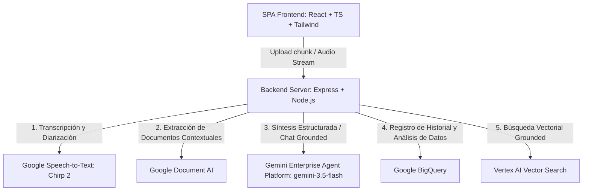

# Technical Specifications (Tech Specs)
## Proyecto: PLAUD Corporate Intelligence (PLAUD-CI)

Este documento detalla la arquitectura técnica, la pila de tecnologías, la integración de servicios de Google Cloud Platform (GCP) y el diseño de la API para el desarrollo de la plataforma corporativa PLAUD-CI.

---

## 1. Arquitectura General del Sistema

El sistema sigue una arquitectura cliente-servidor clásica optimizada para flujos de trabajo multimodales de inteligencia artificial y procesamiento de datos pesados:



---

## 2. Integración de Servicios de Google Cloud (GCP)

Para ofrecer características verdaderamente corporativas del más alto rendimiento y confiabilidad, la infraestructura se basa en los siguientes servicios avanzados de Google:

### 2.1 Gemini Enterprise Agent Platform (Vertex AI)
*   **Modelo Principal (`gemini-3.5-flash`)**: Utilizado para la generación de la estructura general en formato JSON que compone el resumen ejecutivo, las flashcards, las actividades accionables y la estructura de nodos jerárquicos del mapa mental. Destaca por su velocidad ultrarrápida y rentabilidad.
*   **Modelo de Alta Capacidad (`gemini-1.5-pro` / `gemini-3.5-pro` según región)**: Se activa de manera automática para el análisis cruzado de múltiples grabaciones de reuniones largas (más de 3 horas) y bibliotecas extensas de documentos de negocio, aprovechando su ventana de contexto nativa de más de 1 a 2 millones de tokens.
*   **SDK Integrado**: Uso del nuevo paquete oficial de desarrollo de Google:
    ```typescript
    import { GoogleGenAI, Type } from "@google/genai";
    const ai = new GoogleGenAI({ apiKey: process.env.GEMINI_API_KEY });
    ```

### 2.2 Transcripción y Diarización con Google Speech-to-Text (Chirp 2)
*   **Core Tecnológico**: Chirp 2 es el modelo de habla universal de Google, con excelente rendimiento en múltiples idiomas, incluyendo dialectos regionales del español y del inglés.
*   **Diarización (Speaker Diarization)**: Configuración técnica para el reconocimiento automático de la separación de voces:
    ```json
    {
      "config": {
        "model": "chirp_2",
        "language_codes": ["es-ES", "en-US"],
        "diarization_config": {
          "enable_speaker_diarization": true,
          "min_speaker_count": 2,
          "max_speaker_count": 8
        }
      }
    }
    ```
*   **Resultado de Transcripción**: Mapeo de intervenciones en objetos estructurados:
    ```typescript
    interface DialogueSegment {
      speakerId: string; // ej. "Speaker_1"
      startTime: string; // ej. "00:04:15"
      endTime: string;   // ej. "00:04:42"
      text: string;      // "Establecimos que el presupuesto definitivo se aprobará el viernes."
    }
    ```

### 2.3 Google Document AI (Procesamiento de Documentos de Negocio)
*   **Objetivo**: Convertir documentos no estructurados (PDFs escaneados de actas anteriores, facturas, agendas contractuales o manuales de arquitectura) en texto completamente digitalizado estructurado (OCR).
*   **Uso del Procesador General (Document OCR)**: Extrae el texto y su posicionamiento para alimentar el prompt de contexto de Gemini de manera limpia, evitando distorsiones del texto típicas de los lectores tradicionales de PDFs.

### 2.4 Google BigQuery (Repositorio de Inteligencia y Datos Corporativos)
*   **Objetivo**: Centralizar las transcripciones históricas, las métricas de rendimiento organizacional de las reuniones y el log de control para auditorías.
*   **Esquema de Base de Datos Diseñado**:
    *   `sessions`: Registra el ID de la sesión, título corporativo de la reunión, fecha, duración total del audio, número de hablantes detectados y sentimiento promedio.
    *   `action_items`: Registra las tareas derivadas, responsable asignado (Speaker ID), estado (completado/pendiente), y fecha límite.
    *   `analytics`: Tabla optimizada para almacenar métricas de tiempo de palabra por hablante (quién habló más tiempo en la reunión para auditoría de equilibrio del equipo).

### 2.5 Concepto NotebookLM (Soporte RAG con Vertex AI Vector Search)
*   **Búsqueda Semántica de Reuniones**: En lugar de chatear únicamente con una reunión aislada, las transcripciones se fragmentan en chunks lógicos de texto, se convierten en vectores densos (usando el modelo `text-embedding-004`) y se almacenan en **Vertex AI Vector Search**.
*   **Consultas Globales del Espacio de Trabajo**: Permite al usuario preguntar: *"¿Qué decisiones se han tomado en las últimas 3 reuniones del departamento de finanzas sobre el presupuesto?"*. La aplicación recupera semánticamente los fragmentos de audio correctos y genera una respuesta 100% fiel y basada en la evidencia real corporativa.

---

## 3. Especificaciones de la Interfaz y Visualización

### 3.1 Transcripción con Reproducción Sincronizada
*   La pantalla dividida muestra la transcripción a un costado del reproductor multimedia.
*   Hacer clic sobre un bloque de diálogo (ej. "Speaker 1 - [02:15]") salta automáticamente el cursor de reproducción de audio/video al segundo exacto (135s) para escuchar la intervención original.

### 3.2 Infografías y Gráficos Interactivos
*   La pantalla de "Infografías" renderiza gráficos basados en especificaciones SVG nativas generadas dinámicamente por la IA o bien por la librería **Apache ECharts**.
*   **Gráficos principales incluidos**:
    *   *Distribución de Voz*: Gráfico de dona (Pie Chart) indicando el porcentaje de participación activa en la conversación para cada uno de los hablantes.
    *   *Línea de Tiempo del Sentimiento*: Gráfico de líneas (Line Chart) mapeando las fluctuaciones en el tono de la reunión (ej. discusión acalorada vs. acuerdos positivos) a lo largo del tiempo.
    *   *Pipeline de Flujo de Trabajo*: Visualización de flujo horizontal (Sankey o diagramas de pasos) para reflejar las etapas de un proceso de negocio discutido en la sesión.

---

## 4. Diseño del Flujo de Datos del Backend

1.  **Recepción**: El servidor Node.js en [server.ts](server.ts) recibe chunks binarios de audio/video a través de `/api/upload-chunk` y los consolida mediante `/api/merge-chunks`.
2.  **Diarización y Análisis OCR**: 
    *   Envía el archivo consolidation a **Google Speech-to-Text (Chirp 2)** para obtener la transcripción diarizada con timestamps.
    *   Paralelamente, si hay documentos contextuales PDF cargados, los analiza en **Google Document AI**.
3.  **Prompting Estructurado**:
    Se envía la transcripción resultante con los timestamps de los Speakers y el texto de los documentos extraídos a **Gemini** con una llamada de generación estructurada (Structured Output JSON) que garantiza el retorno exacto de las secciones del PRD.
4.  **Almacenamiento y Enriquecimiento**:
    Se guarda el resultado estructurado en el navegador (`localStorage` para rapidez) y se replica el log histórico de la sesión y las métricas en **BigQuery** para fines analíticos de la empresa.
5.  **Respuestas del Asistente**: 
    El endpoint `/api/chat` utiliza el contexto grounding de la reunión seleccionada para responder al usuario de forma segura y sin alucinaciones.
