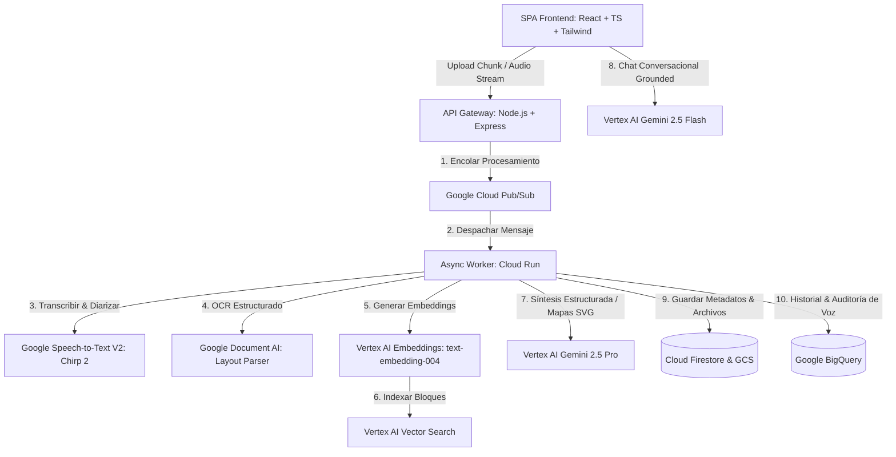

# Technical Specifications (Tech Specs)
## Proyecto: PLAUD Corporate Intelligence (PLAUD-CI)

Este documento detalla la arquitectura técnica corporativa, la pila de tecnologías de última generación, la integración de servicios avanzados de Google Cloud Platform (GCP) de nivel empresarial y el diseño de la API para la plataforma **PLAUD-CI**.

---

## 1. Arquitectura General del Sistema

Para soportar flujos de trabajo de inteligencia artificial multimodal y procesamiento pesado de audio/video de hasta 4 horas de duración, el sistema sigue una arquitectura desacoplada y asíncrona de alto rendimiento:



---

## 2. Integración de Servicios de Google Cloud (GCP) Enterprise

La infraestructura técnica prioriza la excelencia, precisión y confidencialidad exigida por las corporaciones financieras y tecnológicas globales.

### 2.1 Vertex AI Gemini Enterprise
Se implementa un modelo híbrido para optimizar tiempos de respuesta y profundidad de razonamiento:

*   **Modelo de Alta Capacidad (Vertex AI `gemini-2.5-pro`)**: Utilizado para el pipeline asíncrono principal (transcripción estructurada, generación del resumen ejecutivo estructurado, SVG del mapa mental y tarjetas de memoria). Su ventana de contexto de 2 millones de tokens permite procesar múltiples reuniones largas consecutivas sin truncamientos.
*   **Modelo de Baja Latencia (Vertex AI `gemini-2.5-flash`)**: Utilizado en el backend del chat conversacional (`ChatBuddy`) para ofrecer subsegundos de latencia en respuestas en tiempo real.
*   **Seguridad y Gobernanza**: 
    *   No-entrenamiento garantizado mediante acuerdos comerciales de Vertex AI.
    *   Soporte para Claves de Cifrado Administradas por el Cliente (CMEK) a través de **Cloud KMS**.
    *   Residencia de datos estricta en la zona asignada (ej. `us-central1` o `europe-west3`).

### 2.2 Transcripción y Diarización con Google Speech-to-Text V2 (Chirp 2)
*   **Core Tecnológico**: Migración completa a la API V2 de Speech-to-Text usando el modelo unificado `chirp_2`. Este modelo de habla universal posee redes neuronales convolucionales recurrentes entrenadas con millones de horas de grabaciones multilingües.
*   **Diarización y Multi-idioma**: Configuración técnica para el reconocimiento automático de la separación de voces y cambios automáticos de idioma en la conversación:
    ```json
    {
      "recognizer": "projects/plaud-own/locations/global/recognizers/chirp2-recognizer",
      "config": {
        "auto_decoding_config": {},
        "features": {
          "enable_word_time_offsets": true,
          "enable_word_confidence": true
        },
        "model": "chirp_2",
        "language_codes": ["es-ES", "en-US"],
        "diarization_config": {
          "min_speaker_count": 2,
          "max_speaker_count": 8
        }
      }
    }
    ```
*   **Resultado de Transcripción Estructurada**:
    ```typescript
    interface DialogueSegment {
      speakerId: string;    // ej. "Julio" (resuelto tras mapeo) o "Speaker 1"
      startTime: number;    // Segundos desde el inicio, ej. 255.4
      endTime: number;      // Segundos desde el inicio, ej. 290.1
      text: string;         // "Establecimos que el presupuesto definitivo se aprobará el viernes."
    }
    ```

### 2.3 Google Document AI (Procesamiento de Documentos de Negocio)
*   **Objetivo**: Convertir documentos complementarios cargados (actas pasadas, contratos PDF o presentaciones PPTX) en texto digital jerárquicamente estructurado.
*   **Procesador `Layout Parser`**: Este procesador avanzado de Document AI identifica de forma nativa la diferencia entre títulos, subtítulos, columnas, tablas financieras completas e incluso texto escrito a mano.
*   **Beneficio**: Evita la degradación de texto de los extractores de PDF convencionales, entregando a los embeddings un documento con estructura lógica limpia.

### 2.4 Vertex AI Vector Search (RAG Corporativo estilo NotebookLM)
*   **Segmentación (Chunking)**: Las transcripciones históricas y los documentos empresariales procesados por Document AI se segmentan en bloques semánticos de 500 tokens con un solapamiento del 10%.
*   **Generación de Embeddings**: Cada bloque es convertido en un vector numérico de 768 dimensiones utilizando el modelo de última generación **Vertex AI `text-embedding-004`**.
*   **Indexación Semántica**: Los vectores se almacenan en un índice de **Vertex AI Vector Search** con algoritmos de búsqueda del vecino más cercano aproximado (ANN) mediante grafos HNSW.
*   **Grounding**: Al chatear en `ChatBuddy` sobre múltiples archivos, la IA realiza una búsqueda semántica de los vectores más relevantes, recupera los fragmentos lógicos de texto y genera respuestas 100% verídicas citando documentos e intervalos de tiempo exactos.

### 2.5 Google BigQuery (Repositorio de Auditoría y Analíticas de Colaboración)
*   **Objetivo**: Almacenar de forma segura el histórico analítico y de control de las sesiones corporativas.
*   **Estructura de Datos Diseñada**:
    *   `sessions`: ID de sesión, título, duración, idioma detectado, oradores y sentimiento general.
    *   `action_items_audit`: Seguimiento histórico de estados de tareas, responsables y fechas de expiración.
    *   `voice_analytics`: Datos métricos de tiempo de habla detallado por orador y por minuto (para evaluar la distribución de voz y participación activa del equipo).

---

## 3. Especificaciones de la Interfaz y Visualización Premium

La experiencia del usuario final se inspira en el diseño de columna única ultra-limpio de **PLAUD Web**, enfocado en la lectura analítica.

### 3.1 Layout Documento-Céntrico de Columna Única (Single-Column)
*   **Lector de Documentos**: Un lienzo central optimizado con ancho de lectura ideal de `max-w-3xl` o `max-w-4xl` para visualización del resumen ejecutivo o la transcripción, eliminando la sobrecarga visual de múltiples columnas concurrentes.
*   **Sidebar de Historial y Carpetas**: Una columna izquierda angosta que agrupa accesos de perfil, folders corporativos (temas) e historial cronológico con indicadores de duración.
*   **Paneles Deslizables (Drawers)**: El chat con el copilot y las analíticas de gráficos se ocultan en un panel lateral derecho (drawer) que se desliza suavemente sobre la pantalla al invocarse, manteniendo el foco del documento limpio.

### 3.2 Transcripción con Reproducción Sincronizada
*   La transcripción se presenta organizada en bloques interactivos basados en los `DialogueSegment`.
*   Cada bloque posee un control de timestamp (`🕒 [HH:MM:SS]`) interactivo. Hacer clic en cualquier sección de la transcripción salta de forma instantánea el reproductor multimedia (`audioRef.current.currentTime`) al segundo exacto, facilitando la auditoría de voz.

### 3.3 Dashboard de Analíticas e Infografías
*   Renderización dinámica de gráficos basados en SVG y **Apache ECharts** integrados:
    *   **Distribución de Voz**: Gráfico de dona (Pie Chart) indicando el porcentaje y minutos de participación activa para cada uno de los oradores en la reunión.
    *   **Línea de Tiempo del Sentimiento**: Gráfico de líneas (Line Chart) que mapea las fluctuaciones del tono conversacional por minutos (identificando acuerdos positivos, momentos neutrales o tensiones de debate).
    *   **Pipeline de Procesos de Negocio**: Diagramas de flujo horizontales autogenerados basados en SVG para visualizar workflows estratégicos discutidos.

---

## 4. Diseño del Flujo de Datos del Backend y Procesamiento Asíncrono

Para garantizar la estabilidad en grabaciones extensas (1 a 4 horas), el backend opera con un ciclo de procesamiento de colas desacopladas:

1.  **Recepción y Segmentación**: El servidor Express recibe los fragmentos de audio/video cargados por el cliente a través de `/api/upload-chunk` y los almacena temporalmente.
2.  **Consolidación y Almacenamiento Primario**: `/api/merge-chunks` consolida el archivo definitivo, lo sube a **Google Cloud Storage (GCS)** con cifrado KMS y emite un mensaje JSON a un tema de **Cloud Pub/Sub** indicando el ID de la sesión.
3.  **Procesamiento asíncrono**: Un Worker escalable en **Cloud Run** recibe el mensaje, descarga el audio desde GCS y ejecuta el transcoding optimizado (FFMPEG lineal PCM de 16-bit a 16kHz mono).
4.  **Ejecución del Pipeline de Inteligencia**:
    *   Llama en paralelo a **Speech-to-Text V2 (Chirp 2)** para la transcripción y diarización premium.
    *   Si existen PDFs cargados, ejecuta el OCR estructural con **Document AI**.
    *   Vectoriza el contenido y alimenta el índice semántico de **Vertex AI Vector Search**.
5.  **Síntesis con Gemini 2.5 Pro**: Envía la transcripción y el contexto documental a **Gemini 2.5 Pro** con generación estructurada obligatoria en formato JSON para re-etiquetar oradores, estructurar resúmenes ejecutivos en Markdown, extraer planes de acción y generar nodos jerárquicos del mapa conceptual.
6.  **Sincronización Final**: El Worker actualiza el estado de la sesión a `"completed"` en **Cloud Firestore**, notificando al cliente en tiempo real y persistiendo las métricas analíticas en **Google BigQuery**.
